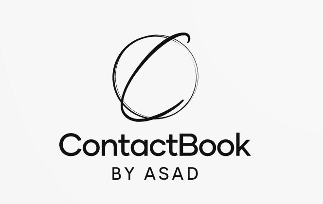

<!-- Improved compatibility of back to top link: See: https://github.com/othneildrew/Best-README-Template/pull/73 -->
<a name="readme-top"></a>

<!-- PROJECT SHIELDS -->
[![Contributors][contributors-shield]][contributors-url]
[![Forks][forks-shield]][forks-url]
[![Stargazers][stars-shield]][stars-url]
[![Issues][issues-shield]][issues-url]
[![MIT License][license-shield]][license-url]
[![LinkedIn][linkedin-shield]][linkedin-url]


<!-- PROJECT LOGO -->
<br />
<div align="center">
  <a href="https://github.com/asadbutttt/contactbook">
    
  </a>

  <h3 align="center">A Simple ContactBook to meet all your needs!</h3>

  <p align="center">
    Create, Update, Delete and Tag all your contacts!
    <br />
    <a href="https://github.com/asadbutttt/contactbook"><strong>Explore the docs »</strong></a>
    <br />
    <br />
    <a href="https://github.com/asadbutttt/contactbook">View Demo</a>
    ·
    <a href="https://github.com/asadbutttt/contactbook/issues">Report Bug</a>
    ·
    <a href="https://github.com/asadbutttt/contactbook/issues">Request Feature</a>
  </p>
</div>


<!-- TABLE OF CONTENTS -->
<details>
  <summary>Table of Contents</summary>
  <ol>
    <li>
      <a href="#about-the-project">About The Project</a>
      <ul>
        <li><a href="#built-with">Built With</a></li>
      </ul>
    </li>
    <li>
      <a href="#getting-started">Getting Started</a>
      <ul>
        <li><a href="#prerequisites">Prerequisites</a></li>
        <li><a href="#installation">Installation</a></li>
      </ul>
    </li>
    <li><a href="#usage">Usage</a></li>
    <li><a href="#roadmap">Roadmap</a></li>
    <li><a href="#contributing">Contributing</a></li>
    <li><a href="#license">License</a></li>
    <li><a href="#contact">Contact</a></li>
    <li><a href="#acknowledgments">Acknowledgments</a></li>
  </ol>
</details>


<!-- ABOUT THE PROJECT -->
## About The Project

[![Homescreen Schreenshot][product-screenshot2]](https://github.com/asadbutttt/contactbook)

[![Creat new Contact Screenshot][product-screenshot1]](https://github.com/asadbutttt/contactbook)

There are many ways to store your contacts online! This contactbook provides you a unique way to easily create and organize all your contacts at one place!

Here's why:
* Your time is important thus creating or manipulating contacts is a breeze
* You shouldn't be doing the same tasks over and over 
* You should implement DRY principles to the rest of your life

Use the `BLANK_README.md` to get started.

<p align="right">(<a href="#readme-top">back to top</a>)</p>


### Built With

* [![Django][Django]][django-url]
* [![Bootstrap][Bootstrap.com]][Bootstrap-url]
* [![JQuery][JQuery.com]][JQuery-url]

<p align="right">(<a href="#readme-top">back to top</a>)</p>


<!-- GETTING STARTED -->
## Getting Started

This is a simple project built with Django web framework.

### Prerequisites

Python should already be installed in order to use the ContactBook.

* django

  ```sh
  pip install django
  ```

### Installation

_Easily clone the repo and start working. No API keys or any other complex installation required._

1. Clone the repo
   ```sh
   git clone https://github.com/asadbutttt/contactbook.git
   ```
3. Install the requirements as already mentioned in ```requirements.txt``` file
   ```sh
   pip install -r requirements.txt
   ```
4. Run using command ```runserver```
   ```py
   python manage.py runserver
   ```

<p align="right">(<a href="#readme-top">back to top</a>)</p>


<!-- USAGE EXAMPLES -->
## Usage

The contactbook can be used to organize all your contacts with simple tags! The builtin tagging mechanism makes it very easy to find / update / delete the contacts.

_For more examples, please refer to the [Documentation](asadbutttt/contactbook/)_

<p align="right">(<a href="#readme-top">back to top</a>)</p>

<!-- ROADMAP -->
## Roadmap

- [x] Made simple v 1.0
- [x] Made v 2.0 with AJAX and tagged views
- [ ] Implementation of REST framework
- [ ] Implementation of React for improved frontend 
- [ ] Implementation of Celery for optimization
- [ ] Multi-language Support
    - [ ] Spanish
    - [ ] German

See the [open issues](https://github.com/asadbutttt/contactbook/issues) for a full list of proposed features (and known issues).

<p align="right">(<a href="#readme-top">back to top</a>)</p>


<!-- CONTRIBUTING -->
## Contributing

Contributions are what make the open source community such an amazing place to learn, inspire, and create. Any contributions you make are **greatly appreciated**.

If you have a suggestion that would make this better, please fork the repo and create a pull request. You can also simply open an issue with the tag "enhancement".
Don't forget to give the project a star! Thanks again!

1. Fork the Project
2. Create your Feature Branch (`git checkout -b feature/AmazingFeature`)
3. Commit your Changes (`git commit -m 'Add some AmazingFeature'`)
4. Push to the Branch (`git push origin feature/AmazingFeature`)
5. Open a Pull Request

<p align="right">(<a href="#readme-top">back to top</a>)</p>


<!-- LICENSE -->
## License

Distributed under the MIT License. See `LICENSE.txt` for more information.

<p align="right">(<a href="#readme-top">back to top</a>)</p>


<!-- CONTACT -->
## Contact

Asadullah - [@asadbuttttt](https://twitter.com/asadbuttttt) - asadullah.butt911@live.com

Project Link: [https://github.com/asadbutttt/contactbook/](https://github.com/asadbutttt/contactbook/)

<p align="right">(<a href="#readme-top">back to top</a>)</p>


<!-- ACKNOWLEDGMENTS -->
## Acknowledgments

Use this space to list resources you find helpful and would like to give credit to. I've included a few of my favorites to kick things off!

* [Choose an Open Source License](https://choosealicense.com)
* [GitHub Emoji Cheat Sheet](https://www.webpagefx.com/tools/emoji-cheat-sheet)
* [Malven's Flexbox Cheatsheet](https://flexbox.malven.co/)
* [Malven's Grid Cheatsheet](https://grid.malven.co/)
* [Img Shields](https://shields.io)
* [GitHub Pages](https://pages.github.com)
* [Font Awesome](https://fontawesome.com)
* [React Icons](https://react-icons.github.io/react-icons/search)

<p align="right">(<a href="#readme-top">back to top</a>)</p>


<!-- MARKDOWN LINKS & IMAGES -->
<!-- https://www.markdownguide.org/basic-syntax/#reference-style-links -->
[contributors-shield]: https://img.shields.io/github/contributors/asadbutttt/contactbook.svg?style=flat
[contributors-url]: https://github.com/asadbutttt/contactbook/graphs/contributors
[forks-shield]: https://img.shields.io/github/forks/asadbutttt/contactbook.svg?style=flat
[forks-url]: https://github.com/asadbutttt/contactbook/network/members
[stars-shield]: https://img.shields.io/github/stars/asadbutttt/contactbook.svg?style=flat
[stars-url]: https://github.com/asadbutttt/contactbook/stargazers
[issues-shield]: https://img.shields.io/github/issues/asadbutttt/contactbook.svg?style=flat
[issues-url]: https://github.com/asadbutttt/contactbook/issues
[license-shield]: https://img.shields.io/github/license/asadbutttt/contactbook.svg?style=flat
[license-url]: https://github.com/asadbutttt/contactbook/LICENSE.txt
[linkedin-shield]: https://img.shields.io/badge/-LinkedIn-black.svg?style=flat&logo=linkedin&colorB=555
[linkedin-url]: https://www.linkedin.com/in/asad-butt-87b73a250/
[product-screenshot2]: media/ss_1.png
[product-screenshot1]: media/ss_2.png

[Django]: https://img.shields.io/badge/Django-000000?style=for-the-badge&logo=django&logoColor=white
[django-url]: https://www.djangoproject.com/
[Bootstrap.com]: https://img.shields.io/badge/Bootstrap-563D7C?style=for-the-badge&logo=bootstrap&logoColor=white
[Bootstrap-url]: https://getbootstrap.com
[JQuery.com]: https://img.shields.io/badge/jQuery-0769AD?style=for-the-badge&logo=jquery&logoColor=white
[JQuery-url]: https://jquery.com 